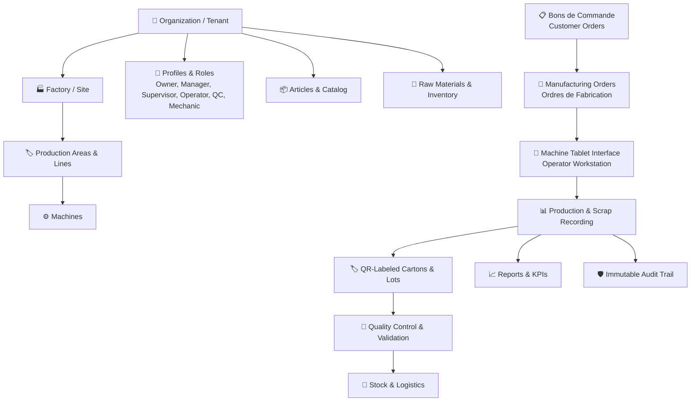

# FACTORYFLOW TN — PRODUCT OVERVIEW

## 1. Positioning & Mission
**"Replace Excel and paper production tracking with one simple, robust multi-tenant platform for production, machines, workers, materials, waste, inventory, and reports."**

FactoryFlow TN is engineered specifically for manufacturing plants (packaging, adhesive tapes, plastics, metal conversion, and general industrial assembly) in Tunisia and emerging markets.

---

## 2. Core Modules

---

## 3. User Roles & Permissions

| Role | Scope & Permissions | Key User Interface |
| :--- | :--- | :--- |
| **Owner** | Full organization control, settings, user management, billing, all factories. | Admin Management Dashboard |
| **Manager** | Create OFs, assign machines, monitor production, inventory, view reports. | Admin Management Dashboard |
| **Supervisor** | Realtime monitoring, downtime oversight, scrap validation, order tracking. | Production / Live Dashboard |
| **Operator** | Simple machine workstation interface: Start, Pause, Finish, Log Qty, Log Scrap. | **Tablet Workstation (`/tablet`)** |
| **Quality Controller** | Scan QR cartons, check metrology/weights, approve/reject lots. | **Scanner / QC (`/scanner`, `/admin/qualite`)** |
| **Mechanic** | View machine stops, handle breakdown interventions, resolve maintenance tickets. | **Mechanic App (`/mechanic`)** |
| **Viewer** | Read-only access to dashboards and production analytics. | Read-only Dashboard |

---

## 4. Key Workflows

### 4.1 Order to Carton Workflow
1. **Order Initiation:** Manager creates Bon de Commande or direct Ordre de Fabrication (OF).
2. **Scheduling:** OF is assigned to a Machine line, target quantity, deadline, and operator.
3. **Execution on Tablet:** Operator selects assigned machine & OF, starts run, records good quantity and scrap.
4. **Lot & QR Generation:** System produces unique sequential carton numbers with QR codes.
5. **Quality Gate:** QC inspects samples (weight, metrage, adherence), stamps conforming or flags non-conformance.
6. **Warehouse Ingestion:** Conforming cartons are transferred to finished goods warehouse.
